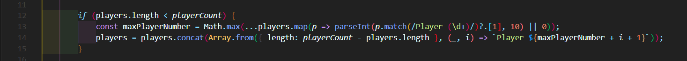

This is my JS Projects repository I will deploy step by step.
turnuva.js is my project that I always develop but try.js is my example project that I hold algorithms, codes that I want to turn and look at it.
in my turnuva project the playerCount can be change but with for statement I used in there:

can make player name go up or down like if playerCount = 8; my last player name is Player 8 or if playerCount = 4; my last player name is Player 4.

in Node.js folder I learned how to use JSON with JavaScript

Explanation
if (players.length < playerCount):

This line checks whether the number of current players (players.length) is less than the number of players specified by the user (playerCount).
If the current number of players is insufficient, it is necessary to generate and add the missing players.

const maxPlayerNumber = Math.max(...players.map(p => parseInt(p.match(/Player (\d+)/)?.[1], 10) || 0));:

This line finds the highest player number from the existing player names.

players.map(p => parseInt(p.match(/Player (\d+)/)?.[1], 10) || 0):

The players.map function transforms player names into an array of numbers.

p.match(/Player (\d+)/)?.[1]: Extracts the number from each player name (e.g., 5 from Player 5).

parseInt(..., 10) || 0: Uses 0 as a default if the number cannot be found (i.e., if the match is null or undefined).

Math.max(...):

Finds the largest number from the array of player numbers.

players = players.concat(Array.from({ length: playerCount - players.length }, (_, i) => Player ${maxPlayerNumber + i + 1}));:

Array.from({ length: playerCount - players.length }):

Creates an array of the size needed to fill in the missing players (e.g., if 10 players are needed but only 5 exist, it creates an array with 5 elements).

(_, i) => Player ${maxPlayerNumber + i + 1}:

This function generates a player name for each element of the array. The expression maxPlayerNumber + i + 1 creates new player numbers starting from the highest existing number.

For example, if maxPlayerNumber is 10, the additional players will be named Player 11, Player 12, and so on.

players.concat(...):

Adds these new players to the existing list of players.

Summary

This code automatically generates missing players to reach the desired number of players. It starts numbering from the highest existing player number and adds new player names to the list. This way, the list of players is updated to match the specified number, allowing the tournament to start with the required number of participants.