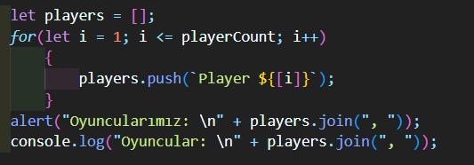

This is my JS Projects repository I will deploy step by step.
turnuva.js is my project that I always develop but try.js is my example project that I hold algorithms, codes that I want to turn and look at it.
in my turnuva project the playerCount can be change but with for statement I used in there:

can make player name go up or down like if playerCount = 8; my last player name is Player 8 or if playerCount = 4; my last player name is Player 4.

in Node.js folder I learned how to use JSON with JavaScript